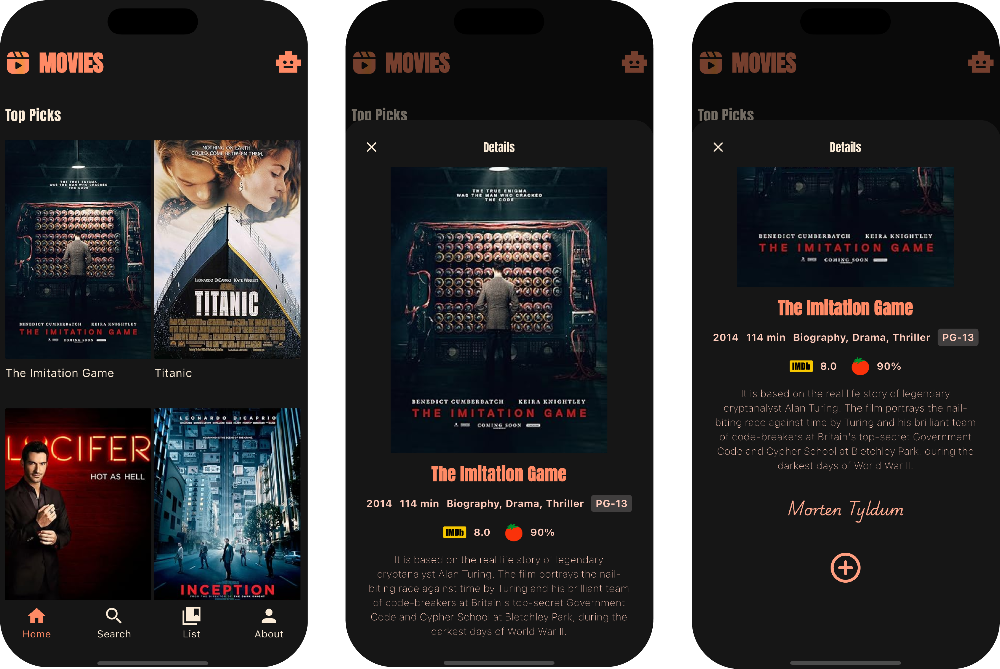
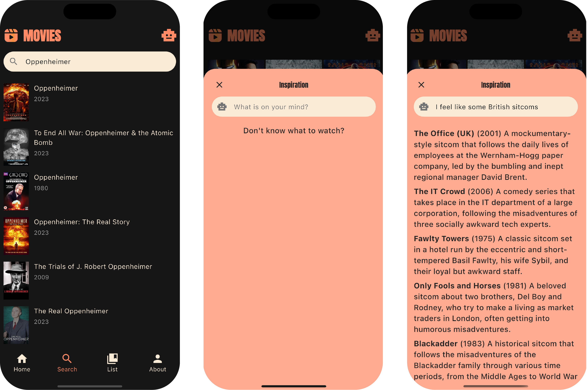

## Introduction
An iOS app built for movie lovers who want to keep all their favourite films in one place. Developed using Flutter and Dart, the app offers a clean, user-friendly interface for organizing and managing your personal movie collection.

## IMDB and Rotten Tomatoes Ratings
Each movie entry includes both **IMDb** and **Rotten Tomatoes** ratings, giving you a broader perspective on its popularity and critical reception. You can easily add movies to your watchlist or remove them as your preferences change.

## Search by Movie Titles or Ask an AI Agent
On the **Search** page, you can look up movies or TV shows by title. Alternatively, tap the **robot icon** in the top-right corner to access an **AI assistant** that can help you brainstorm what to watch next.

